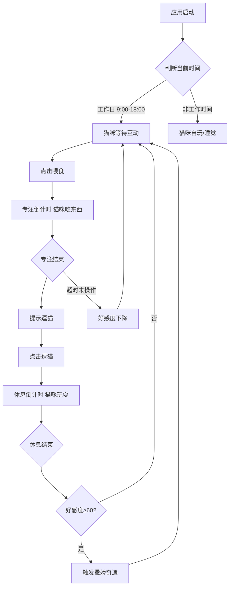

## 1. 产品概述

超萌猫咪宠物番茄时钟——一款将番茄工作法与虚拟宠物养成结合的桌面伴侣应用。用户在法定工作日9:00-18:00期间需要按时"喂食"（专注时段）和"逗猫"（休息时段），否则猫咪好感度下降；好感度60以上触发撒娇奇遇事件。非工作时间猫咪自行玩耍或睡觉。

- 目标用户：需要专注工作的办公人群、远程工作者、学生
- 核心价值：用萌宠养成机制增强番茄钟的执行动力，让时间管理不再枯燥

## 2. 核心功能

### 2.1 用户角色
无多角色区分，单用户桌面应用

### 2.2 功能模块
1. **主界面**：猫咪角色展示、番茄时钟倒计时、好感度面板、互动按钮
2. **设置面板**：番茄钟时长配置、通知设置

### 2.3 页面详情

| 页面名称 | 模块名称 | 功能描述 |
|---------|---------|---------|
| 主界面 | 猫咪角色区 | CSS绘制的超萌猫咪角色，根据状态展示不同动画（待机、吃东西、玩耍、睡觉、撒娇、不开心） |
| 主界面 | 番茄时钟区 | 圆形倒计时进度条，显示当前阶段（专注/休息）、剩余时间、轮次计数 |
| 主界面 | 好感度面板 | 好感度数值和进度条，5颗心评级显示，好感度变化动画 |
| 主界面 | 互动按钮区 | "喂食"按钮（专注开始）、"逗猫"按钮（休息开始）、"跳过"按钮 |
| 主界面 | 奇遇弹窗 | 好感度≥60时随机触发的撒娇奇遇事件，展示可爱动画和文案 |
| 主界面 | 拖拽交互 | 长按猫咪可抓起拖拽到屏幕任意位置，松手后猫咪落地弹跳 |
| 设置面板 | 时钟配置 | 专注时长（默认25分钟）、短休息时长（默认5分钟）、长休息时长（默认15分钟）、长休息间隔（默认4轮） |
| 设置面板 | 通知设置 | 声音提醒开关、浏览器通知开关 |

## 3. 核心流程

用户打开应用后，猫咪出现在屏幕上。在工作日9:00-18:00期间，猫咪处于"等待"状态，期待用户互动。用户点击"喂食"开始专注倒计时，猫咪进入"吃东西"动画；专注结束后提示"逗猫"，猫咪进入"玩耍"动画。若超时未操作，好感度下降。好感度≥60时，猫咪随机撒娇触发奇遇事件。非工作日或非工作时段，猫咪自行玩耍或睡觉。

## 4. 用户界面设计

### 4.1 设计风格
- **主色调**：温暖奶油色(#FFF8E7)为底，珊瑚粉(#FF8A80)和薄荷绿(#A5D6A7)为点缀
- **辅助色**：焦糖棕(#8D6E63)用于猫咪主体，柔紫(#CE93D8)用于奇遇特效
- **按钮风格**：圆角胶囊按钮，3D凸起效果，按下有弹性缩放动画
- **字体**：标题使用圆润可爱的字体，正文使用清晰易读的圆体
- **布局风格**：居中悬浮卡片式，半透明毛玻璃背景
- **图标/Emoji风格**：手绘风猫咪表情，配合CSS动画实现表情变化
- **整体氛围**：温馨、治愈、可爱，像养了一只真正的小猫

### 4.2 页面设计概览

| 页面名称 | 模块名称 | UI元素 |
|---------|---------|--------|
| 主界面 | 猫咪角色区 | CSS绘制猫咪，6种状态动画（待机摇晃、吃东西嘴巴动、玩耍跳跃、睡觉ZZZ、撒娇打滚、不开心耷拉耳朵），拖拽时猫咪张爪悬空 |
| 主界面 | 番茄时钟区 | 圆环进度条（专注珊瑚粉/休息薄荷绿），中央大字体倒计时，下方阶段标签和轮次 |
| 主界面 | 好感度面板 | 左上角心形进度条，5颗心从灰到红渐变，数值显示，变化时心形弹跳动画 |
| 主界面 | 互动按钮区 | 底部两个大圆角按钮，喂食按钮带小鱼干图标，逗猫按钮带毛线球图标，hover发光效果 |
| 主界面 | 奇遇弹窗 | 居中弹出卡片，星星闪烁背景，猫咪特写动画，奇遇文案，关闭按钮 |
| 设置面板 | 整体 | 右上角齿轮图标打开，侧滑面板，滑块调节时长，开关切换通知 |

### 4.3 响应式设计
- 桌面优先设计，窗口大小自适应
- 最小窗口尺寸 400x500，猫咪和按钮等比缩放
- 支持触摸屏操作（长按拖拽）

### 4.4 猫咪状态设计

| 状态 | 触发条件 | 动画表现 |
|------|---------|---------|
| 等待 | 工作时段空闲 | 尾巴轻摇，偶尔眨眼，耳朵微动 |
| 吃东西 | 专注倒计时中 | 低头吃东西，嘴巴咀嚼，满足表情 |
| 玩耍 | 休息倒计时中 | 跳跃追毛线球，翻滚，开心表情 |
| 睡觉 | 非工作时段 | 蜷缩睡觉，ZZZ气泡，偶尔翻身 |
| 撒娇 | 好感度≥60空闲时 | 打滚露肚皮，蹭蹭，发出呼噜声气泡 |
| 不开心 | 好感度<30 | 耷拉耳朵，背对用户，偶尔回头偷看 |
| 被抓起 | 长按拖拽中 | 四肢张开，惊讶表情，轻微挣扎 |
| 落地 | 松手放下 | 弹跳一下，抖抖毛，恢复正常 |
