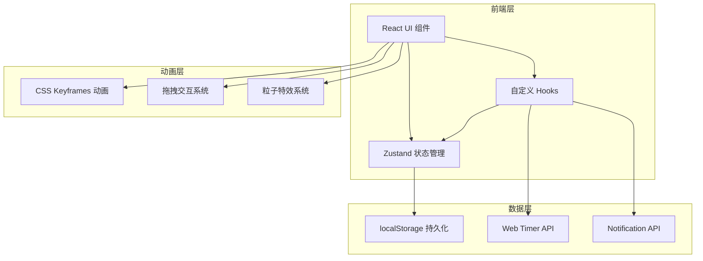
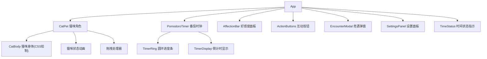

## 1. 架构设计



## 2. 技术说明
- 前端：React@18 + TypeScript + Tailwind CSS + Vite
- 初始化工具：vite-init (react-ts 模板)
- 状态管理：Zustand（含 localStorage 持久化中间件）
- 后端：无（纯前端应用）
- 数据库：无（使用 localStorage 存储用户设置和好感度数据）

## 3. 路由定义

| 路由 | 用途 |
|------|------|
| / | 主界面，包含猫咪角色、番茄时钟、好感度面板、互动按钮 |

## 4. 核心数据模型

### 4.1 状态模型定义

```typescript
interface PomodoroState {
  phase: 'idle' | 'focus' | 'break' | 'long-break'
  timeRemaining: number
  currentRound: number
  totalRounds: number
  isPaused: boolean
}

interface CatState {
  mood: 'waiting' | 'eating' | 'playing' | 'sleeping' | 'cuddly' | 'unhappy' | 'grabbed' | 'landing'
  affection: number
  position: { x: number; y: number }
  isDragging: boolean
}

interface Settings {
  focusDuration: number
  shortBreakDuration: number
  longBreakDuration: number
  longBreakInterval: number
  soundEnabled: boolean
  notificationEnabled: boolean
}

interface Encounter {
  id: string
  title: string
  description: string
  emoji: string
  affectionBonus: number
}
```

### 4.2 好感度规则

| 事件 | 好感度变化 |
|------|-----------|
| 完成一次专注 | +8 |
| 完成一次休息互动 | +5 |
| 专注超时未开始 | -3 |
| 休息超时未互动 | -2 |
| 触发奇遇事件 | +3~+10 |
| 每日首次登录 | +5 |
| 好感度自然衰减（每小时，仅工作时段） | -1 |

### 4.3 奇遇事件池

| 奇遇名称 | 描述 | 好感度奖励 |
|---------|------|-----------|
| 猫咪送礼物 | 小猫叼来一片叶子放在你面前 | +5 |
| 踩键盘 | 小猫踩上键盘打出一串乱码 | +3 |
| 翻肚皮 | 小猫翻出软软的肚皮让你摸 | +8 |
| 追尾巴 | 小猫转圈追自己的尾巴 | +4 |
| 打哈欠传染 | 小猫打了个大哈欠，你也忍不住打了一个 | +6 |
| 踩奶 | 小猫在你腿上踩奶，发出咕噜声 | +10 |
| 窗边看鸟 | 小猫蹲在窗边专注地看外面的小鸟 | +5 |
| 纸箱探险 | 小猫钻进纸箱只露出尾巴 | +7 |

## 5. 组件架构



## 6. 自定义 Hooks

| Hook 名称 | 功能 |
|-----------|------|
| usePomodoro | 管理番茄钟状态、倒计时、阶段切换 |
| useCatMood | 根据番茄钟状态和时间计算猫咪心情 |
| useAffection | 管理好感度增减、奇遇触发判断 |
| useDrag | 处理猫咪长按拖拽交互 |
| useTimeAwareness | 判断当前是否为工作日工作时段 |
| useNotification | 管理浏览器通知和声音提醒 |
| useLocalStorage | Zustand 持久化中间件封装 |

## 7. 动画实现方案

- **猫咪动画**：纯CSS keyframes实现，通过状态class切换不同动画
- **进度条动画**：SVG圆环 + CSS transition实现平滑进度
- **好感度变化**：数字跳动 + 心形弹跳 CSS动画
- **奇遇弹窗**：CSS transform + opacity入场动画，星星粒子用CSS animation
- **拖拽反馈**：CSS transform: scale(1.1) + box-shadow增强，松手弹跳用CSS spring动画
- **睡觉ZZZ**：CSS animation上浮渐隐循环
